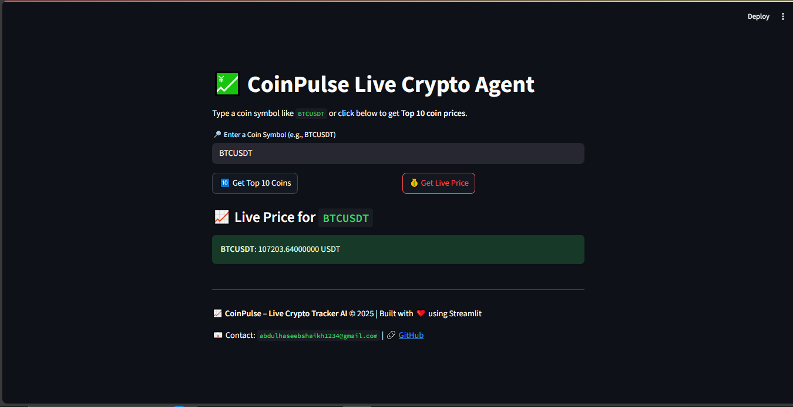
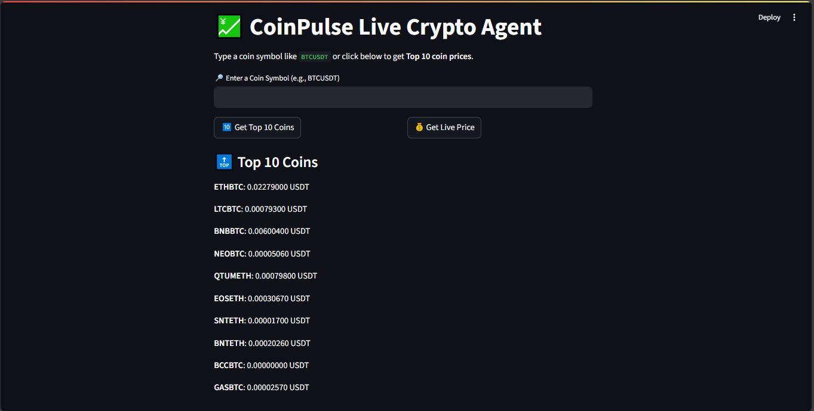

# 📈 CoinPulse – Live Crypto Tracker

CoinPulse is a modern, user-friendly web application for tracking live cryptocurrency prices. Built with [Streamlit](https://streamlit.io/), it allows users to quickly view the latest prices for the top 10 cryptocurrencies or check the real-time price of any coin by symbol (e.g., `BTCUSDT`).

---

## 🚀 Features

- **Live Crypto Price Lookup:** Instantly fetch the latest price for any coin using its symbol.
- **Top 10 Coins:** View the current prices of the top 10 cryptocurrencies by market activity.
- **Clean, Responsive UI:** Simple and intuitive interface powered by Streamlit.
- **Reliable Data Source:** Uses the official [Binance API](https://binance-docs.github.io/apidocs/spot/en/#ticker-price) for up-to-date pricing.

---

## 🖥️ Demo



---

## 🛠️ Installation & Setup

1. **Clone the repository:**
   ```bash
   git clone https://github.com/Abdul-Haseeb360/coinpulse-crypto-tracker.git
   cd coinpulse-crypto-tracker
   ```

2. **Create and activate a virtual environment:**
   - On Windows (PowerShell):
     ```powershell
     uv venv
     .\.venv\Scripts\Activate.ps1
     ```
   - On macOS/Linux:
     ```bash
     uv venv
     source .venv/bin/activate
     ```

3. **Install dependencies:**
   ```bash
   uv pip install -r requirements.txt
   # or, if using pyproject.toml:
   uv pip install
   ```

4. **Run the app:**
   ```bash
   streamlit run main.py
   ```

---

## ⚙️ Usage

- **Get Top 10 Coins:** Click the "🔟 Get Top 10 Coins" button to see the latest prices.
- **Get Live Price:** Enter a coin symbol (e.g., `BTCUSDT`) and click "💰 Get Live Price" to fetch its current price.

---

## 📦 Dependencies

- Python >= 3.13
- streamlit >= 1.46.0
- requests
- dotenv
- streamlit-autorefresh

All dependencies are managed via `pyproject.toml` and `uv`.

---

## 📄 License

This project is currently unlicensed. Please add a LICENSE file before public or commercial use.

---

## 👤 Author & Contact

- **Abdul Haseeb Shaikh**  
  📧 Email: abdulhaseebshaikh1234@gmail.com  
  🔗 [GitHub](https://github.com/Abdul-Haseeb360)
  🔗 [LinkedIn](https://www.linkedin.com/in/abdul-haseeb-shaikh-491605219/)

---

## 🙏 Acknowledgements

- [Binance API](https://binance.com/)
- [Streamlit](https://streamlit.io/)

---

> © 2025 CoinPulse – Live Crypto Tracker AI. Built with ❤️ using Streamlit.
